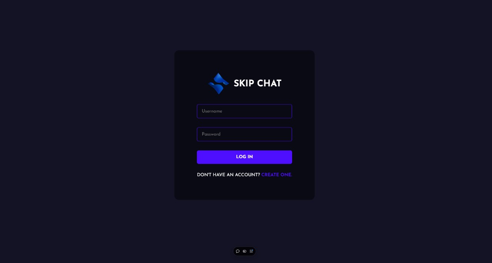
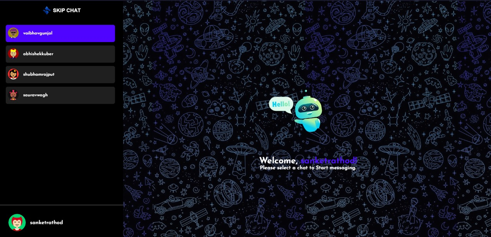
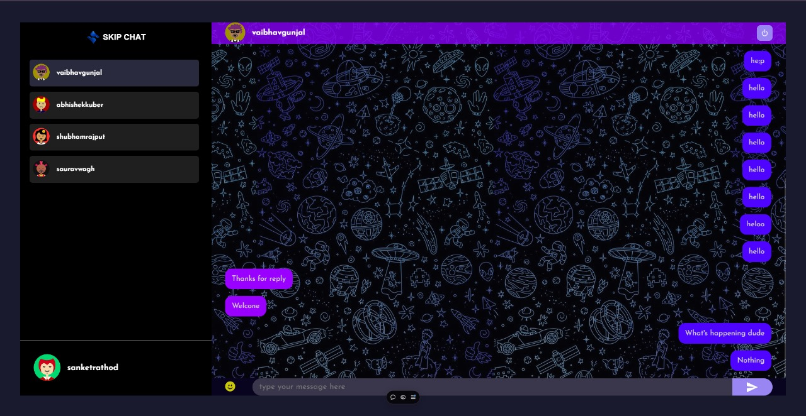

# SkipChat - Real-Time Chat Application

SkipChat is a real-time chat application built with TypeScript, React.js, MongoDB, and Socket.io. SkipChat provides an easy-to-use, secure environment for users to connect and chat in real time. [here](https://www.youtube.com/@sanketrathodofficial)







## Installation Guide

### Requirements

- [Nodejs](https://nodejs.org/en/download)
- [Mongodb](https://www.mongodb.com/docs/manual/administration/install-community/)

Both should be installed and make sure mongodb is running.

### Installation

#### First Method

```shell
git clone https://github.com/sanketrathod07/skipchat.git
cd skipchat
```

To streamline and secure your configuration, you'll need to create separate .env files for both the frontend and backend.

Now install the dependencies

```shell
cd server
npm install
cd ..
cd public
npm install
```

We are almost done, Now just start the development server.

For Frontend.

```shell
cd public
npm start
```
Now open (localhost:3000) in your browser.

For Backend.

Open another terminal in folder, Also make sure mongodb is running in background.

```shell
cd server
npm start
```

Done! Now open (localhost:5000) in your browser.

#### Second Method

- This method requires docker and docker-compose to be installed in your system.
- Make sure you are in the root of your project and run the following command.

```shell
docker compose build --no-cache
```

after the build is complete run the containers using the following command

```shell
docker compose up
```

now open localhost:3000 in your browser.# skipchat